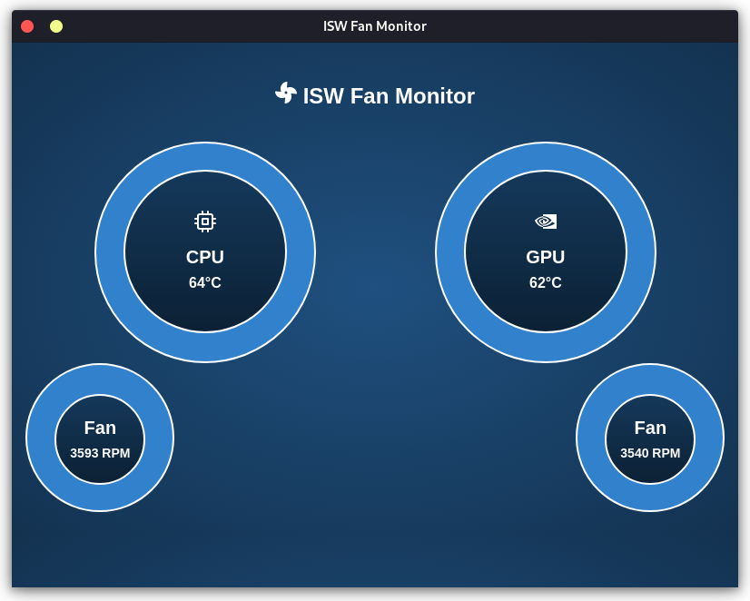

# ISW Fan Monitor
ISW Fan Monitor is a fan monitor for the ISW. ISW is a fan CLI utility developed by YoyPa for the MSI gaming laptop for Linux.
This little tool is to have a Graphic User Interface to monitor your temp and fan speed, instead to execute it through the console.

For now this MVP, it is only a simple fan monitor, but it will be extended to include more features included in the ISW CLI.

This Fan Monitor UI is developed using [Electron](https://electronjs.org/), and was tested in Manjaro and Arch Linux with Gnome DE.

Download Zip Portable:
https://github.com/jeremy93-2008/isw-fan-monitor/releases/tag/v1.0.0

Screenshots:
   
